# Конспект мастер-класса «Алгоритмы и условия на примере Вити»

Пробное занятие для знакомства детей с программированием, алгоритмами, блок-схемами и условными операторами в Python. Главная история занятия: персонаж Витя собирается на прогулку, а дети помогают ему выбрать одежду и предметы в зависимости от времени года и занятия.

**Аудитория:** дети, впервые знакомящиеся с программированием  
**Формат:** беседа + работа у доски + бумажные карточки + живая демонстрация на платформе  
**Длительность:** 45-60 минут  
**Цель занятия:** ребенок понимает, что алгоритм - это точная последовательность шагов, узнает блок-схемы и условия, а в конце видит, как собранный алгоритм превращается в настоящий код на Python.

---
## Что подготовить

- Компьютер преподавателя с открытой платформой.
- Проектор или большой экран.
- Доска/флипчарт/лист для рисования блок-схем.
- Карточки для блок-схем:
  - «Начало», «Конец»;
  - вопросы: «Какое время года?», «Какое занятие?»;
  - действия: «Надеть теплую куртку», «Взять лыжи», «Взять коньки», «Надеть дождевик», «Взять лодку», «Взять удочку», «Надеть купальный костюм», «Взять плавательные принадлежности», «Надеть футбольную форму», «Взять мяч», «Взять зонт», «Надеть школьную форму», «Взять рюкзак».
- Эталонный код из `README.md` под рукой.

## Слайды к занятию

1. **Мастер-класс по Python** - титульный слайд, включить при приветствии.
2. **Разработка на Python** - коротко рассказать про Python и курс.
3. **Приготовим пиццу** - объяснить алгоритм как последовательность шагов.
4. **Результат** - показать, что правильный алгоритм приводит к результату.
5. **Блок-схема: начало** - показать овал «Начало».
6. **Блок-схема: действие** - показать прямоугольник «Действие».
7. **Блок-схема: конец** - показать овал «Конец».
8. **Блок-схема целиком** - показать простую последовательность «Начало -> действия -> Конец».
9. **Условия** - показать ромб «Если» и ветки «Да» / «Нет».
10. **Условия в Python: `if`** - показать первое ключевое слово.
11. **Условия в Python: `if` / `else`** - показать запасной вариант.
12. **Условия в Python: `if` / `elif` / `else`** - показать несколько вариантов выбора.
13. **Пример кода с погодой** - показать пример с `weather`.
14. **Давайте поиграем** - перейти к практике на платформе.
15. **Разработка на Python** - финальный слайд с приглашением на курс.

## Тайминг

| # | Блок | Время |
| --- | --- | --- |
| 0 | Приветствие и знакомство | 5 мин |
| 1 | Что будем делать сегодня: Python, алгоритмы и курс | 7-8 мин |
| 2 | Алгоритмы на примерах из жизни | 8-10 мин |
| 3 | Блок-схемы: рисуем первый алгоритм | 8-10 мин |
| 4 | Условия: «если..., то...» и `if/elif/else` | 7-10 мин |
| 5 | Практика: собираем Витю из карточек | 12-15 мин |
| 6 | Переводим блок-схему в код на платформе | 10-15 мин |
| 7 | Итоги, вопросы, приглашение на курс | 5 мин |

> **Для преподавателя:** если времени мало, объедините блоки 3 и 4: сначала нарисуйте блок-схему «идет дождь?», а затем сразу покажите ее в виде `if`.

---

## 0. Приветствие и знакомство

> **Показать слайд 1:** «Мастер-класс по Python».

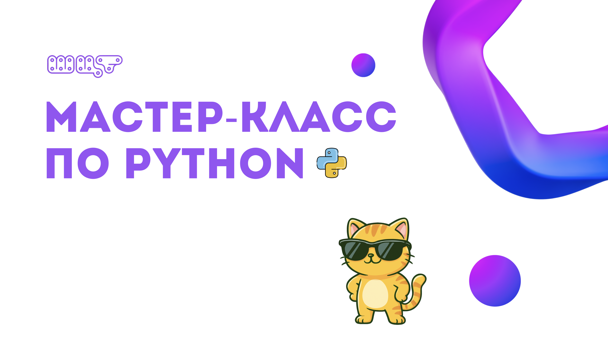

Коротко:

1. Поздороваться, представиться, представить ШЦТ.
2. Спросить детей:
   - кто уже слышал слово «программирование»;
   - кто играл в игры или пользовался приложениями;
   - как они думают, откуда компьютер «знает», что делать.
3. Подвести к теме: сегодня дети попробуют думать как программисты - сначала разберутся, что такое программа, а потом сами составят понятный план действий.

Пример формулировки:

> Сегодня у нас будет занятие-знакомство: немного поговорим, попробуем отвечать на вопросы и потом сразу перейдем к практике.

---

## 1. Что будем делать сегодня: Python, алгоритмы и курс

> **Показать слайд 2:** «Разработка на Python» с короткими тезисами про язык и курс.


**Ключевая мысль:** сегодня дети знакомятся с программированием на Python через понятный практический пример: сначала разбирают алгоритмы и блок-схемы, потом превращают их в код и проверяют результат в игре.

Пример формулировки:

> Сегодня мы с вами познакомимся с программированием на языке Python. Вы узнаете, что такое алгоритмы и блок-схемы, увидите, как пишутся программы на Python, составите свой первый алгоритм и поиграете в игру, где код будет помогать герою Вите собираться на прогулку. А еще я коротко расскажу про наш курс и покажу, какие проекты ребята смогут делать дальше.

Что кратко рассказать про Python:

- Python - один из самых популярных языков программирования.
- На Python пишут сайты, ботов, игры, программы для анализа данных и искусственного интеллекта.
- У Python понятный синтаксис, поэтому с него удобно начинать.

Что кратко рассказать про курс:

- Программа курса создана вместе со специалистами ВШЭ, ЦУ и практикующими разработчиками из Яндекса и Т-Банка.
- Упор на практику: ученики не только слушают теорию, но и делают работающие проекты.
- В конце каждого учебного блока будут хакатоны (соревнования по программированию), на них дети могут проявить креативность, показать свои умения и получить оценки и полезные советы от жюри.

Текст для слайда:

- Python - популярный язык для сайтов, ботов, игр, анализа данных ИИ и многих других сфер в ИТ.
- Практический курс от действующих IT-специалистов.
- Программа создана вместе со специалистами ВШЭ, ЦУ, Яндекса и Т-Банка.
- В конце блоков проходят хакатоны: дети показывают проекты и получают обратную связь.

Переход:

> Начнем с главной идеи программирования: компьютеру нужен точный план действий. Такой план называется алгоритмом.

---

## 2. Что такое алгоритм

**Ключевая мысль:** алгоритм - это последовательность действий, которая приводит к результату. Если шаги понятные и идут в правильном порядке, мы получаем нужный результат.

### Пример: готовим пиццу

> **Показать слайд 3:** «Приготовим пиццу».

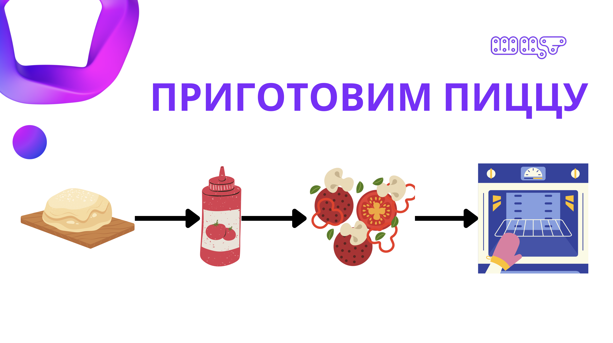

Разобрать слайд с детьми:

```text
Взять тесто -> добавить соус -> положить начинку -> поставить в печь -> получить пиццу
```

Что проговорить:
- У нас есть цель: приготовить пиццу.
- Чтобы получить результат, нужно выполнить действия по порядку.
- Каждый шаг должен быть понятным: что именно делаем и после чего.
- Если пропустить шаг или поменять порядок, результат может получиться неправильным.

Пример формулировки:

> Алгоритм - это как рецепт. Мы не просто говорим «сделай пиццу», а перечисляем точные шаги: сначала берем тесто, потом добавляем соус, кладем начинку, отправляем в печь и получаем результат. В программировании работает так же: компьютер выполняет команды по порядку.

> **Показать слайд 4:** «Результат» и подчеркнуть, что правильная последовательность шагов приводит к готовой пицце.

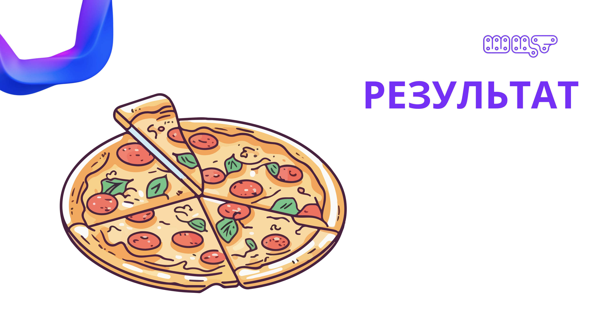

### Интерактив

Задать детям вопросы по слайду:

- Что будет, если сначала поставить тесто в печь, а потом добавить соус?
- Что будет, если забыть начинку?
- Какой шаг здесь первый?
- Какой результат мы хотим получить?

После этого можно попросить детей привести еще 1-2 алгоритма из жизни:

- как почистить зубы;
- как собрать портфель;
- как сделать бутерброд.

Вывод:

> Алгоритмы есть не только в компьютерах. Мы каждый день выполняем алгоритмы, просто обычно не называем их этим словом.

---

## 3. Что такое блок-схема

**Ключевая мысль:** блок-схема - это алгоритм, нарисованный с помощью фигур и стрелок.

### Основные фигуры

> **Показать слайды 5-7:** по очереди объяснить «Начало», «Действие» и «Конец».

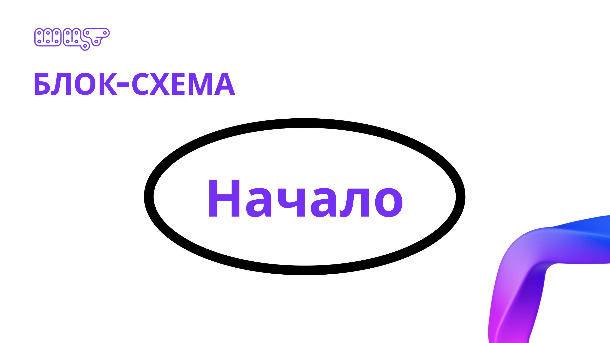

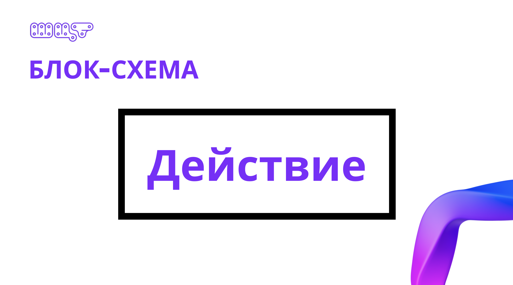


- **Овал** - начало и конец алгоритма.
- **Прямоугольник** - действие: «взять хлеб», «надеть куртку», «взять зонт».
- **Ромб** - вопрос или развилка: «идет дождь?», «сейчас зима?».
- **Стрелки** - показывают порядок выполнения шагов.

### Первый пример у доски: бутерброд

> **Показать слайд 8:** простая блок-схема целиком. Затем нарисовать похожий пример у доски.

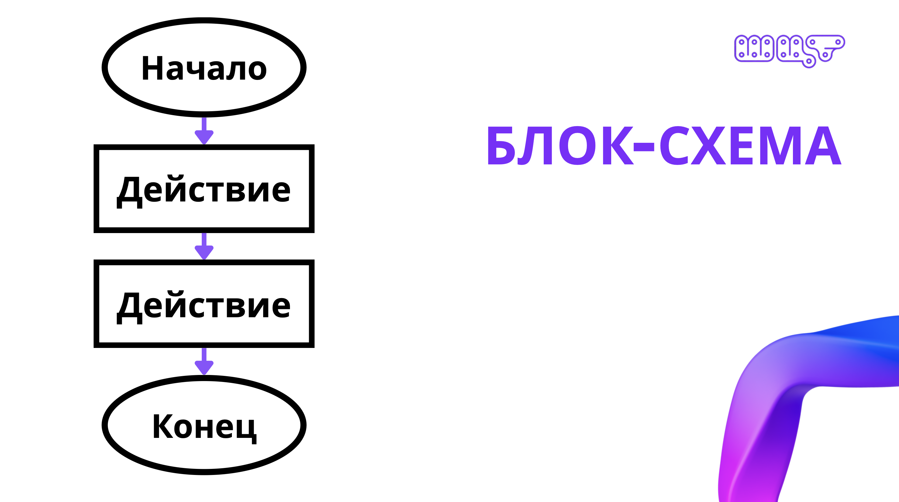

Нарисовать вместе с детьми:

```text
(Начало)
   |
[Взять хлеб]
   |
[Намазать масло]
   |
[Положить сыр]
   |
[Закрыть вторым ломтиком]
   |
(Конец)
```

> **Для преподавателя:** если есть активный ребенок, можно позвать его к доске, а остальные будут диктовать шаги. Ваша задача - мягко поправлять, если дети дают слишком общие или перепутанные команды.

Переход:

> Пока все шаги идут подряд. Но в жизни бывает иначе: иногда нужно выбрать действие в зависимости от ситуации.

---

## 4. Условия: «если..., то...» и `if/elif/else`

**Ключевая мысль:** условие помогает алгоритму принимать решение. Если ответ на вопрос один - выполняется одно действие, если другой - другое.

### Зачем нужны условия

> **Показать слайд 9:** ромб «Если» с ветками «Да» и «Нет».

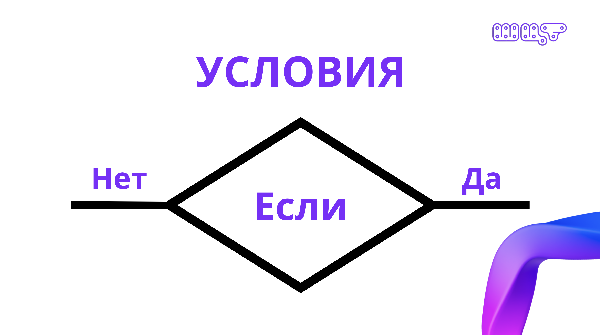

Сначала проговорить:

> Иногда в алгоритме шаги идут не просто один за другим. Иногда нужно задать вопрос и выбрать, что делать дальше. Такой вопрос называется условием.

Можно вернуться к примеру с пиццей и дописать условие в блок-схему после печи:

```text
(Начало)
   |
[Взять тесто]
   |
[Добавить соус]
   |
[Положить начинку]
   |
[Поставить в печь]
   |
<Пицца готова?>
   | да
[Достать пиццу]
   |
(Конец)

<Пицца готова?>
   | нет
[Подождать еще 5 минут]
   |
<Пицца готова?>
```

Что проговорить:

- Ромб в блок-схеме - это вопрос.
- Из ромба могут выходить разные стрелки: например, «да» и «нет».
- От ответа зависит, какое действие выполнится дальше.
- Это и есть условие: «если пицца готова - достаем, иначе ждем еще».

### Как это выглядит в Python

> **Показать слайды 10-12:** сначала `if`, затем `if/else`, затем `if/elif/else`.

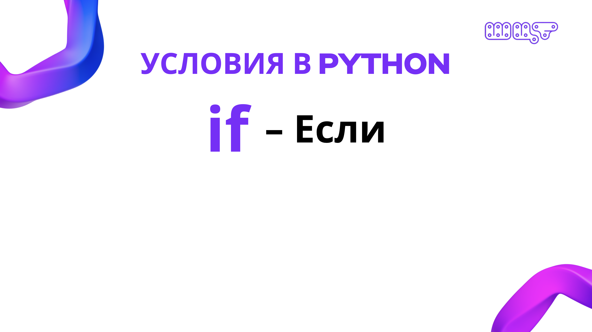

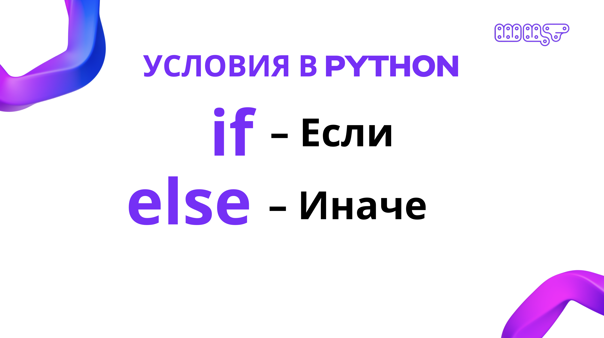

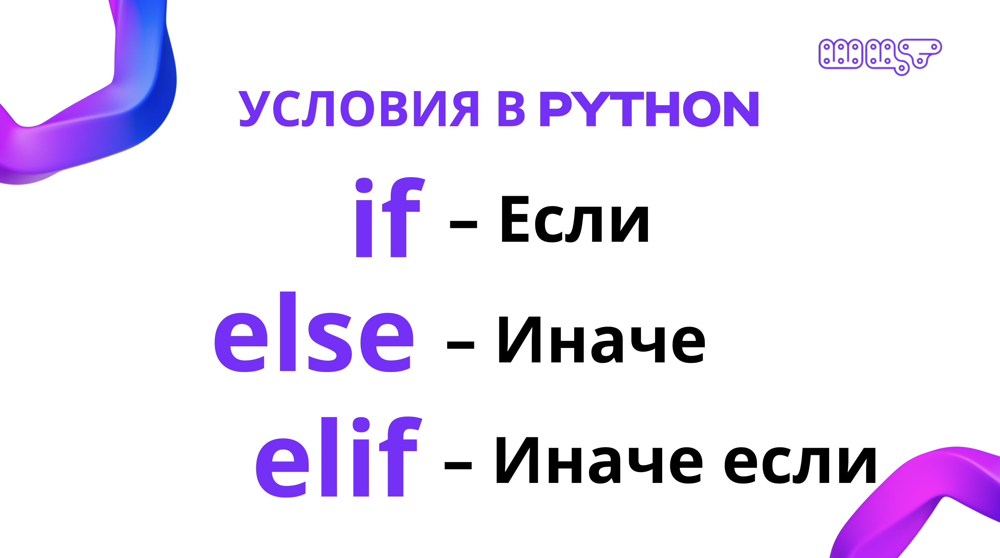

После блок-схемы сказать:

> А теперь давайте посмотрим, как такие условия записываются в Python. Для этого используются слова `if`, `elif` и `else`.


> **Показать слайд 13:** пример кода с погодой.

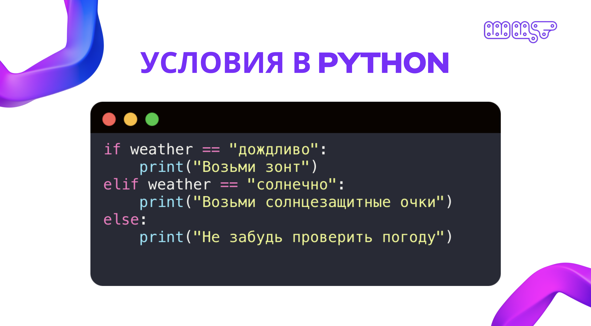

Затем показать пример с несколькими вариантами:

```python
if weather == "дождливо":
    print("Возьми зонт")
elif weather == "солнечно":
    print("Возьми солнцезащитные очки")
else:
    print("Не забудь проверить погоду")
```

Что проговорить:

- `if` - первая проверка: «если погода дождливая».
- `elif` - еще одна проверка: «иначе если погода солнечная».
- `else` - запасной вариант, если ни одно условие выше не подошло.
- Команды внутри условия пишутся с отступом.

> **Для преподавателя:** не углубляйтесь в синтаксис слишком сильно. Цель мастер-класса - показать связь «вопрос в ромбе -> условие в коде».

---

## 5. Практика: собираем алгоритм Вити из карточек

> **Показать слайд 14:** «Давайте поиграем» и перейти к практике на платформе.

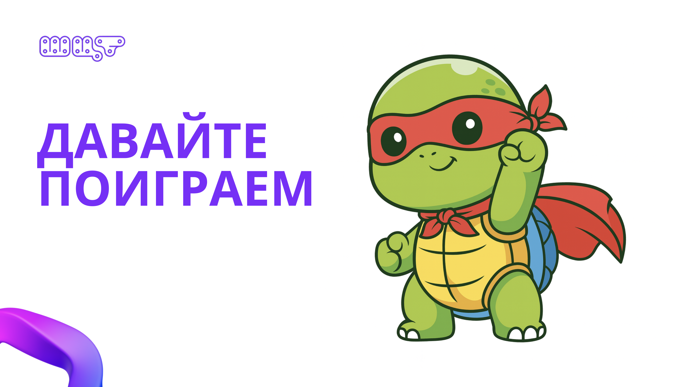

Теперь дети применяют алгоритмы и условия к главной истории занятия.

Сюжет:

> Витя хочет выйти из дома. Но он должен понять, какое сейчас время года и чем он будет заниматься. От этого зависит, что он наденет и что возьмет с собой.

### Варианты на платформе

| Сезон | Занятие | Что должно получиться |
| --- | --- | --- |
| Зима | Ничего особенного | Теплая куртка |
| Зима | Лыжи | Теплая куртка + лыжи |
| Зима | Коньки | Теплая куртка + коньки |
| Весна | Ничего особенного | Дождевик |
| Весна | Бумажные кораблики | Дождевик + лодка |
| Весна | Рыбалка | Дождевик + удочка |
| Лето | Ничего особенного | Обычный вид Вити |
| Лето | Плавание | Купальный костюм + плавательные принадлежности |
| Лето | Футбол | Футбольная форма + мяч |
| Осень | Ничего особенного | Обычный вид Вити |
| Осень | Прогулка под дождем | Дождевик + зонт |
| Осень | Школа | Школьная форма + рюкзак |

### Как вести практику

1. Сначала вся группа вместе собирает одну ветку, например «зима + лыжи».
2. Преподаватель выкладывает «Начало» и задает вопрос: «Что Витя должен узнать сначала?»
3. Дети выбирают карточку-вопрос «Какое время года?»
4. Дальше дети выбирают действие «Надеть теплую куртку».
5. Потом идет второй вопрос: «Какое занятие?»
6. Для лыж дети выбирают действие «Взять лыжи».
7. В конце кладется «Конец».

Пример ветки:

```text
(Начало)
   |
<Какое время года?>
   | зима
[Надеть теплую куртку]
   |
<Какое занятие?>
   | лыжи
[Взять лыжи]
   |
(Конец)
```

Наводящие вопросы:

- Что нужно проверить первым: сезон или занятие?
- Витя должен надеть куртку до того, как возьмет лыжи?
- Если сейчас лето, должна ли сработать зимняя ветка?
- Что произойдет, если мы забудем ветку для коньков?
- Почему для лета и осени без занятия не нужна отдельная команда?

Если детей много:

- первую ветку собрать всем вместе;
- затем разделить детей на небольшие группы по сезонам;
- каждая группа собирает свою часть;
- в конце объединить все ветки в одну общую схему.

Если детей мало:

- не делить на команды;
- идти всем вместе по сезонам;
- каждому ребенку по очереди давать выбрать следующую карточку.

---

## 6. Переводим блок-схему в код на платформе

Преподаватель открывает платформу, показывает редактор кода, выбор времени года и занятия.

**Ключевая мысль:** код - это тот же алгоритм, только записанный на языке, который понимает компьютер.

### Демонстрация

1. Выбрать одну готовую ветку блок-схемы, например «зима + лыжи».
2. Прочитать ее вслух по стрелкам.
3. Начать писать код:

```python
if season == 'winter':
    wear_winter_suit()
    if activity == 'skiing':
        take_skis()
```

4. Показать соответствие:
   - ромб «Какое время года?» -> `if season == 'winter':`;
   - прямоугольник «Надеть теплую куртку» -> `wear_winter_suit()`;
   - ромб «Какое занятие?» -> `if activity == 'skiing':`;
   - прямоугольник «Взять лыжи» -> `take_skis()`.
5. Нажать «Запустить код» и показать, что Витя оделся правильно.
6. Спросить детей, что нужно добавить, чтобы Витя умел кататься на коньках.
7. Добавить `elif`:

```python
if season == 'winter':
    wear_winter_suit()
    if activity == 'skiing':
        take_skis()
    elif activity == 'skating':
        take_skates()
```

8. Постепенно дописать остальные сезоны.
9. В конце нажать «Проверить все», чтобы платформа прогнала все сценарии.

> **Для преподавателя:** печатайте код медленно и вслух. Важнее, чтобы дети увидели связь между схемой и кодом, чем чтобы вы быстро набрали весь эталон.

### Готовый код для финального показа

```python
if season == 'winter':
    wear_winter_suit()
    if activity == 'skiing':
        take_skis()
    elif activity == 'skating':
        take_skates()
elif season == 'spring':
    wear_raincoat_suit()
    if activity == 'launch_paper_boats':
        take_boat()
    elif activity == 'go_fishing':
        take_fishing_rod()
elif season == 'summer':
    if activity == 'swimming':
        wear_swimming_suit()
        take_swimming_equipment()
    elif activity == 'football':
        wear_football_suit()
        take_ball()
elif season == 'autumn':
    if activity == 'walk_in_the_rain':
        wear_raincoat_suit()
        take_umbrella()
    elif activity == 'go_to_school':
        wear_school_suit()
        take_backpack()
```

---

## 7. Итоги и приглашение на курс

> **Показать слайд 15:** финальный слайд «Разработка на Python».

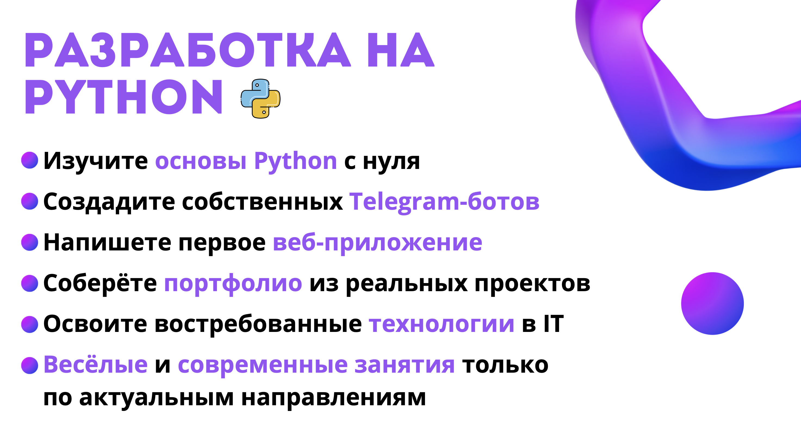

Сначала коротко подвести итог:

- Алгоритм - это точная последовательность действий.
- Блок-схема помогает увидеть алгоритм глазами.
- Ромб в блок-схеме - это вопрос или условие.
- `if`, `elif`, `else` помогают компьютеру выбирать действия.
- Сегодня мы прошли путь: идея -> алгоритм -> блок-схема -> код -> работающая программа.

После этого перейти к приглашению на курс.

Пример формулировки:

> Сегодня вы увидели, что код может управлять настоящей игрой: мы помогали Вите выбирать одежду и предметы с помощью условий. Если хочется узнать больше, научиться самому писать код и делать такие игры, как Витя, а потом и более сложные проекты, записывайтесь на наш курс «Разработка на Python».

Что дети будут делать на курсе:

- изучат основы Python с нуля;
- создадут собственных Telegram-ботов;
- напишут первое веб-приложение;
- соберут портфолио из реальных проектов;
- освоят востребованные технологии в IT;
- будут заниматься на веселых и современных занятиях по актуальным направлениям.

Финальная фраза:

> Сегодня был первый шаг. На курсе мы будем постепенно двигаться дальше: от простых условий и алгоритмов к собственным программам, играм, ботам и веб-проектам.

*[МЕСТО ДЛЯ: организационная информация, расписание, стоимость, контакты, ссылка на запись]*
